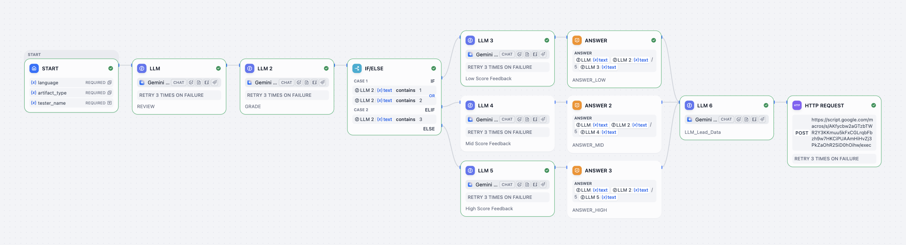
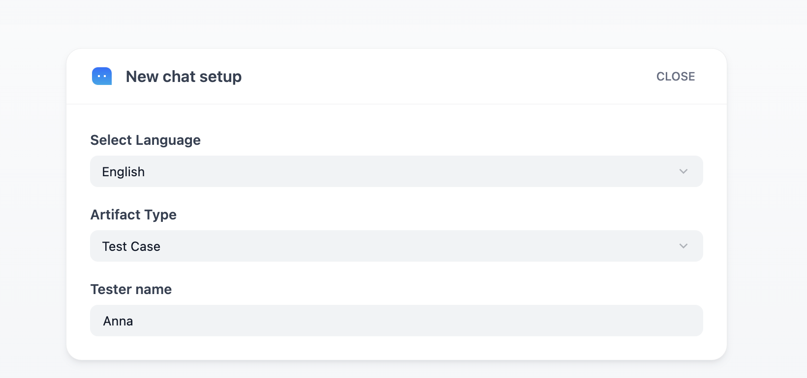
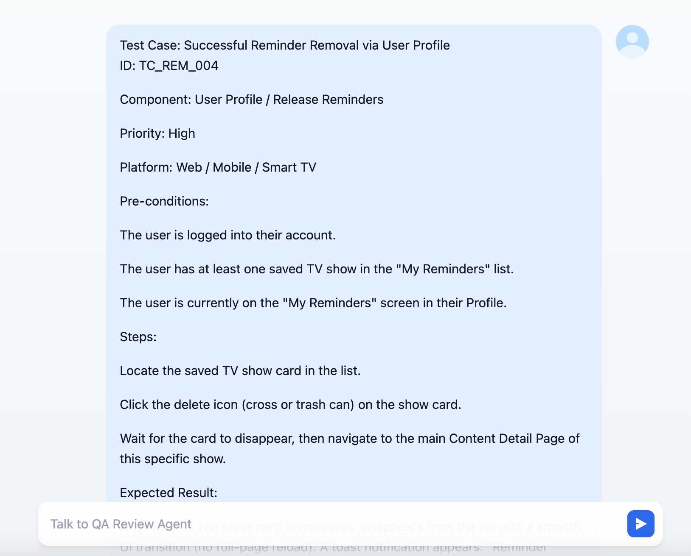
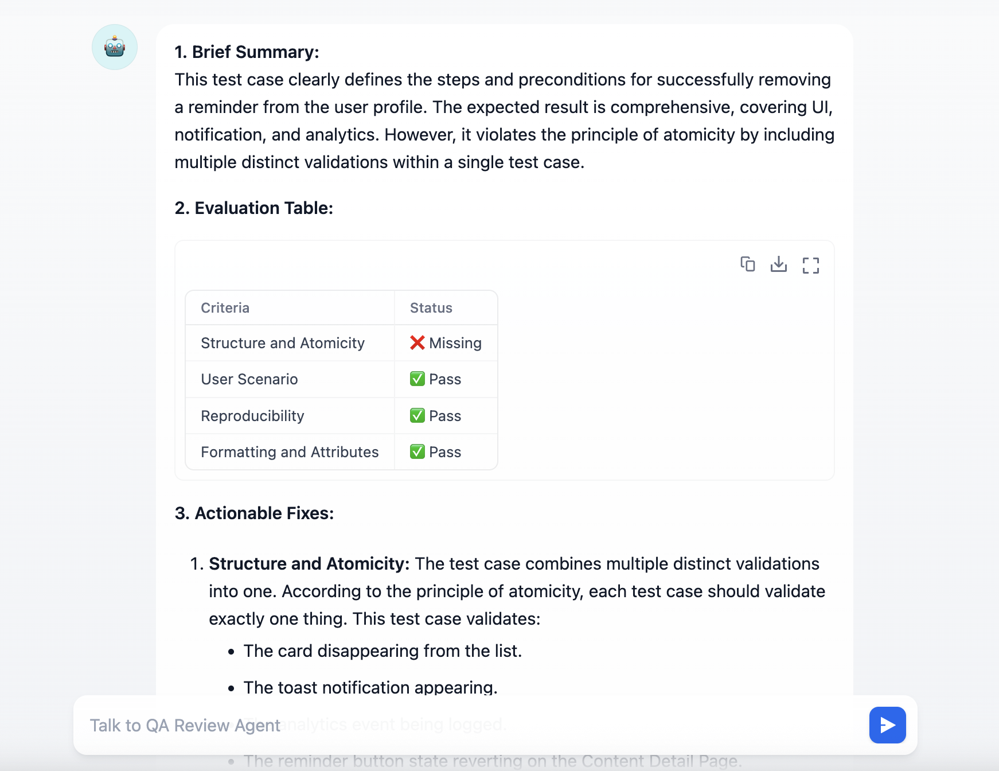
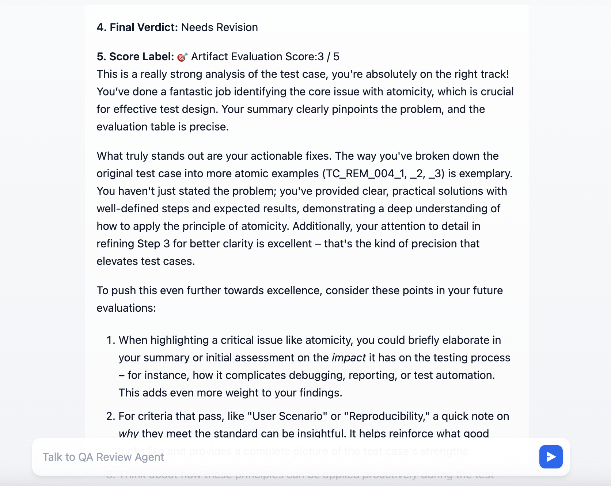
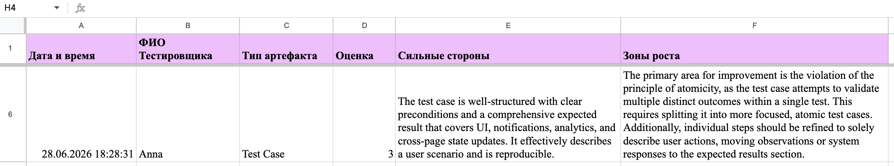

# Autonomous AI QA Reviewer & Management Assistant

> Enterprise-grade cascading agent system to automate QA document reviews and metrics logging.

Built using **Dify (DAG workflow)** and **Google Workspace (Google Apps Script)** via serverless webhooks.

🚀 **Live Demo:** https://udify.app/chat/CfvMPnyGR7PQoF7C 

---

## 🎯 The Problem & Business Impact

In modern agile workflows, QA Leads spend up to **30% of their operational time** manually reviewing junior engineers' test documentation. This operational bottleneck introduces:
* High subjectivity in document evaluation.
* Lack of structured historical metrics for tester professional growth.
* Delayed feedback loops within testing cycles.

**The Solution:** An autonomous Quality Gate that digitizes expert-level QA Lead evaluation criteria into an instantly accessible, deterministic AI-driven ecosystem.

---

## 🏗️ System Architecture & Workflow (DAG)

The core intelligence engine leverages a Directed Acyclic Graph (DAG) workflow within Dify to isolate contexts, prevent LLM hallucinations, and ensure deterministic execution layers.

### Key Architectural Components:
1. **Semantic Conditioning:** Initial processing nodes analyze the layout and language context of the inputted testing artifact.
2. **Cascading Expert Evaluation (LLM Cascades):** Instead of a single generic prompt, the system routes data dynamically via conditional blocks (`IF/ELSE`) to specialized evaluation layers.
3. **Data Normalization Node:** A dedicated clean-up layer processes markdown formats, stripping system symbols to guarantee strict syntax before data export.

---

## 📱 User Interface & Agent Feedback Loops

The AI Agent provides real-time, comprehensive, and multi-layered feedback directly to the engineer, ensuring clear actionable improvement steps and transparent criteria-based scoring.

### 1. Artifact Analysis & Telemetry Generation
The system processes raw inputs and generates structured technical analysis.

### 2. Multi-Criteria Scoring Table
A deterministic grading structure maps the artifact quality across verified QA benchmarks.

### 3. Actionable Areas for Improvement
Clear, objective bullet points highlight exact gaps in coverage or structure.

### 4. Advanced Execution Insights
Detailed telemetry logs generated during the evaluation cycle.

---

## ⚡ Integration Layer (Serverless Middleware)

To ensure **zero infrastructural overhead** and maximum scalability, the data pipeline is completely serverless.

### `webhook_handler.js`

This script acts as the middleware layer, parsing telemetry data and committing it to the spreadsheet repository in real-time.

/**
 * Processes inbound webhook payloads from Dify
 */
function doPost(e) {
  // Uses RegEx for data normalization and appends rows to Google Sheets DB
}

* **Engine:** Google Apps Script served as a flexible middleware.
* **Database:** Structured Google Sheets serving as a central logging system.

---

## 📈 Key Metrics & Validation

Evaluated over active iteration cycles, the system proved high accuracy and business viability:
* ⏱️ **Inference Speed:** 60–90 seconds per complex checklist audit (saving ~15 minutes of manual focus per document).
* 📉 **Time Saved:** Up to **35% reduction** in manual document-review overhead for the QA Lead.
* 🎯 **Consistency:** **100% deterministic logging** of structured grades (1–5 scale), metrics, and actionable items.

---

## 🔮 Strategic Roadmap

* **Zero-Touch Integration:** Establish automated webhooks triggered by Jira status transitions.
* **Contextual Knowledge Retrieval (RAG):** Integrate vector embedding databases with product regulations.
* **Predictive Risk Analytics:** Downstream parsing of logs to predict regression zones.

---
*Developed by a forward-thinking QA Lead focusing on AI Engineering and process optimization.*
